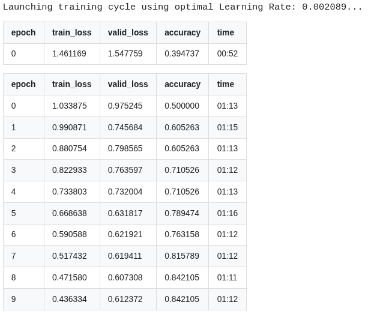
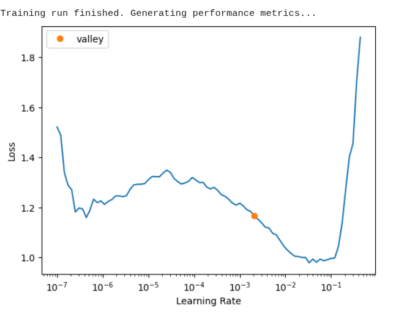
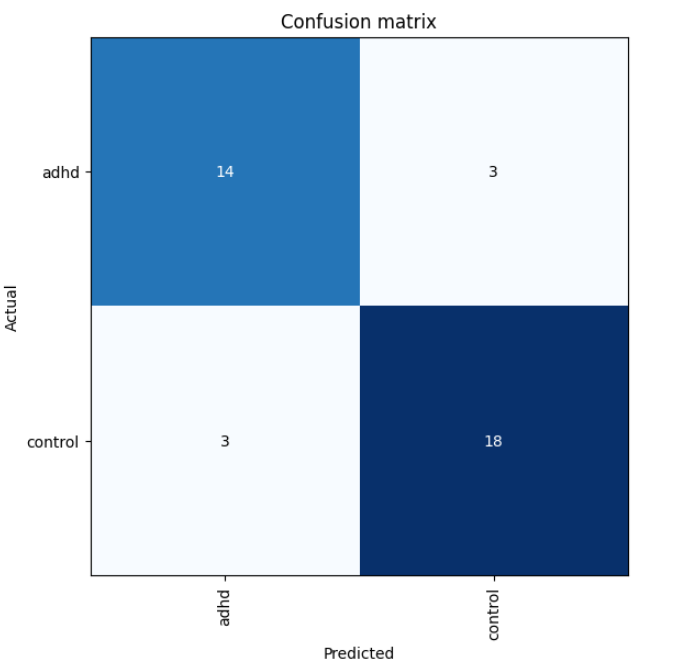

# 👁️🧠 Open-Source NeuroRetina AI

**An open-source machine learning pipeline for objective ADHD and Autism screening via retinal fundus images.**

---

## 🌟 The Vision
The diagnosis of neurodevelopmental conditions like ADHD and Autism Spectrum Disorder (ASD) often relies heavily on subjective behavioral questionnaires, leading to exhausting, multi-year diagnostic journeys for patients. 

Recent breakthroughs in medical AI (e.g., CUHK's ARIA technology, RetinaMind) suggest that microvascular geometries and retinal nerve fiber layers (RNFL) in the eye act as direct biomarkers for neurological variations. 

**This project aims to democratize this research.** We are building an open-source, Deep Learning-based screening tool to identify these retinal biomarkers. Driven by a neurodivergent developer, this project strictly follows Open Science principles to provide accessible screening foundations globally.

## 🛠️ Tech Stack & Infrastructure
*   **Environment:** Google Colab (Cloud GPU)
*   **Frameworks:** PyTorch & FastAI
*   **Data Pipeline:** Pandas, OpenCV, Kaggle API
*   **Current Architecture:** ResNet34 (Transfer Learning)

## 🚀 Current Status: Proof of Concept (PoC) Completed
We have successfully built and verified the complete end-to-end Machine Learning pipeline using a baseline fundus dataset.

### Key Achievements:
1.  **Robust Data Engineering:** Automated pipeline to fetch, parse, and structure medical image datasets.
2.  **Advanced Preprocessing (Ben-Graham Method):** Implemented automated edge-cropping and local contrast normalization (Gaussian Blur Subtraction). 
    *   *Why this matters:* Fundus images from different clinics vary wildly in illumination and color balance. Our preprocessing eliminates camera-specific artifacts, forcing the neural network to focus *strictly* on biological structures (vascular trees, optic disc) rather than learning color shortcuts.
3.  **Validated Training Loop:** Successfully trained a ResNet34 model on the preprocessed baseline data, establishing a clean, reproducible evaluation matrix (Confusion Matrix / Top Losses).

   ### 📊 Training Results & Metrics
Our optimized ResNet34 pipeline achieved a final accuracy of **84.21%** on the validation subset. Below are the training metrics and evaluation plots from the verified run:

#### Training Loss & Learning Rate Selection
The learning rate finder successfully isolated the optimal trajectory valley ($2.88 \times 10^{-3}$), leading to a highly stable convergence without overfitting:

#### Confusion Matrix
The balanced distribution demonstrates that the Ben-Graham preprocessing forced the network to learn legitimate morphological features rather than shortcut artifacts:

## 📊 Dataset & Reproducibility
To ensure full reproducibility of this Proof of Concept (PoC), the pipeline is built using the following publicly available dataset:
* **Dataset Name:** Ocular Disease Recognition (ODIR-5K)
* **Source:** Available on Kaggle via [andrewmvd/ocular-disease-recognition-odir5k](https://www.kaggle.com/datasets/andrewmvd/ocular-disease-recognition-odir5k)
* **Usage in this project:** Healthy control samples ("N") and disease samples ("D") were utilized to validate the infrastructure and test the Ben-Graham contrast-normalization pipeline.

## 🗺️ Roadmap & Next Steps
- [x] Establish Deep Learning infrastructure and dummy-data validation.
- [x] Implement medical-grade image preprocessing (Ben-Graham).
- [ ] **Data Acquisition:** Secure access to authentic ADHD/ASD labeled fundus datasets (e.g., via UK Biobank, AI-Hub, or academic collaborations).
- [ ] **Architecture Upgrade:** Transition from ResNet34 to ResNet50 or Vision Transformers (ViT) to capture micro-tortuosity in vessels.
- [ ] **API Deployment:** Wrap the trained weights (`.pkl`) in a lightweight FastAPI inference endpoint.

## 🤝 Call for Collaboration / Data Providers
The pipeline is ready. **We are currently seeking researchers, clinicians, or institutions willing to share anonymized fundus or OCT datasets linked to ICD-10 F90 (ADHD) or F84 (Autism) diagnoses.** 

If you support Open Science and want to collaborate on bringing objective neurodivergent screening to life, please reach out or open an issue!

## 🧠 Acknowledgments & Inspiration
This project is deeply inspired by pioneering research in the field of retinal biomarkers for neurodevelopmental conditions. We highly acknowledge and build upon the following works:

* **Edward Kang's "RetinaMind" (2026)** - Award-winning project focusing on advanced retinal screening and molecular biomarkers. 
  * [Explore the RetinaMind Project / Paper](https://www.retinamind.com/)
* **The Chinese University of Hong Kong (CUHK)** - Breakthrough research on Automatic Retinal Image Analysis (ARIA) technology led by Prof. Benny Zee, proving the correlation between retinal structures and neurodevelopmental traits.
  * [Read the CUHK ARIA Research Paper / Institute Page](https://www2.ccrb.cuhk.edu.hk/web/innovation-and-entrepreneurship/automatic-retinal-image-analysis-system/)

We highly respect their contributions and aim to expand upon their foundations to bring open-source, objective screening tools to families worldwide.

---
*Developed with logic, passion, and AI assistance.*
